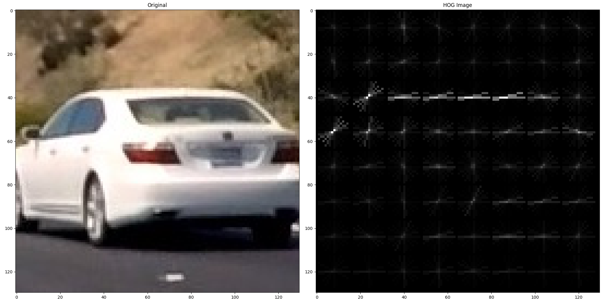
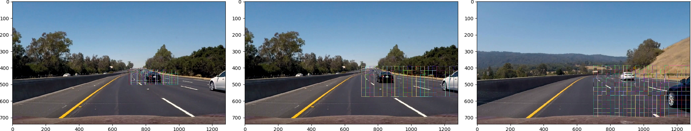
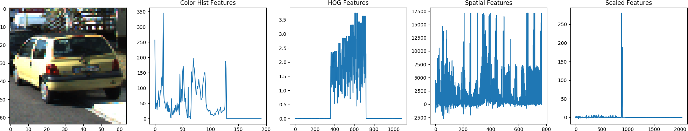
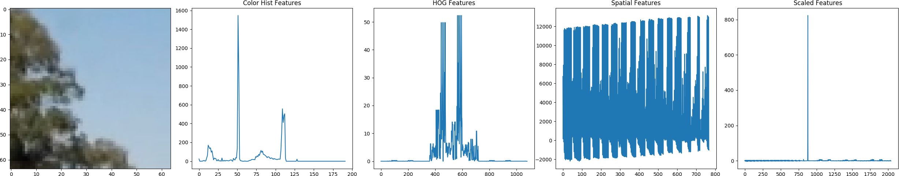
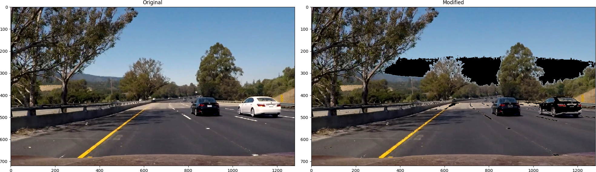
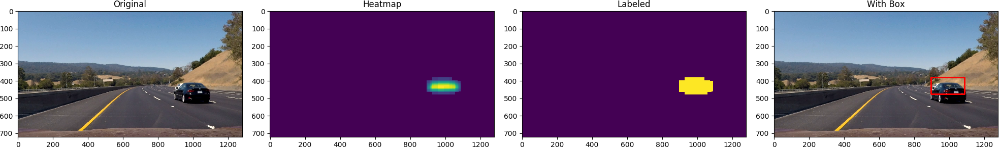

# Udacity Self Driving Car Nanodegree

## Term 1, Project 5 -- Vehicle Detection and Tracking

### Name: Ciaran Murphy
### Date: 30-Nov-2017

---

The goals / steps of this project are the following:

* Perform a Histogram of Oriented Gradients (HOG) feature extraction on
  a labeled training set of images and train a classifier (e.g. Linear SVM)
* Optionally apply other feature extraction steps like color binning, color
  histograms, etc
* Train a classifier such as Support Vector Machine to detect cars in images
  & video
* Implement a sliding-window algorithm to enable the classifier to
  search for vehicles in images
* Run the pipeline on a video stream and create a heat map of recurring
  detections frame by frame. Reject outliers and follow detected vehicles
* Estimate a bounding box for vehicles detected

The implementation script is in the main workspace of the git repo and is called
`obj_detection.py`. It expects command line args as follows:

```bash
(carnd-term1) ciaran@ciaran-XPS-13-9360:sdc_term_1_proj_5$ python ./obj_detection.py -h
usage: obj_detection.py [-h] (-t TRAIN_SIZE | -v INPUT_VIDEO) [-0 VIDEO_START]
                        [-1 VIDEO_END] [-s SAVE_FILE] [-o OUTPUT_VIDEO]
                        [-c CLF_FNAME] [-d SCALER_FNAME] [-g]

optional arguments:
  -h, --help            show this help message and exit
  -t TRAIN_SIZE, --train TRAIN_SIZE
                        Include the training step and use TRAIN value as the
                        number of _notcar_ samples to use for training on.
                        Specify 'all' to train on all available data. If not
                        including training, must specify a classifier to load
                        from disk (a previously pickled one) using the `-c`
                        switch. The number of car samples loaded for training
                        will be porportional to the number of notcar samples
                        specified here.
  -v INPUT_VIDEO, --videoin INPUT_VIDEO
                        The input video file
  -0 VIDEO_START, --t0 VIDEO_START
                        T0 -- time in seconds to start the video from
  -1 VIDEO_END, --t1 VIDEO_END
                        T1 -- time in seconds to end the video at
  -s SAVE_FILE, --save SAVE_FILE
                        Where to save the SVM model back to disk (if training)
  -o OUTPUT_VIDEO, --videoout OUTPUT_VIDEO
                        The video output file
  -c CLF_FNAME, --classifier CLF_FNAME
                        Where to find a previously pickled SVM file to use if
                        not training
  -d SCALER_FNAME, --stdscaler SCALER_FNAME
                        Where to find a previously pickled StandadrScaler for
                        the SVM
  -g, --debug           Debug mode - things like include all rectangles to
                        output video and possibly print more logs.
(carnd-term1) ciaran@ciaran-XPS-13-9360:sdc_term_1_proj_5$ 


```

Here I will consider the rubric points individually and describe how I
addressed each point in my implementation.

---

## [Rubric](https://review.udacity.com/#!/rubrics/513/view) Points


### Writeup / README

#### Provide a Writeup / README

You're reading it!

### Histogram of Oriented Gradients (HOG)

#### 1. Explain how (and identify where in your code) you extracted HOG features from the training images

The code to implement HOG feature extraction is contained in the method
`get_hog()` and has the following docstring:

```python
def get_hog(img, orient=10, pix_per_cell=16, cell_per_block=2, channel='all', tcmap='HSV'):
    """Get a Histogram of Oriented Gradients for an image.

    "Note: you could also include a keyword to set the tranform_sqrt flag but
    for this exercise you can just leave this at the default value of
    transform_sqrt=False"

    Args:
        img: the input image
        orient: the number of orientation bins in the output histogram. Typical values 
            are between 6 and 12
        pixper_cell: a 2-tuple giving the number of pixels per cell e.g. `(9, 9)`
        cells_per_block: a 2-tuple giving the number of cells per block
        channel: which of the 3 color channels to get the HOG for, or 'all'
        tcmap: target color map. the image will be converted to this color space 
            before processing

    Returns:
        (features, hog_image) were the features are rolled out as a 1-D vector

    """

```

Histogram of oriented gradients (HOG) is a feature descriptor used to detect
objects in images. The HOG counts occurrences of gradient orientation in
localized portions of an image. With HOG, a single vector is created that
represents the object. The following parameters need to be chosen:

* Orient: This is the number of orientation bins in the output histogram 
* Pixels per cell: The number of pixels to include in each cell of the HOG 
* Cells per block: The number of cells to include per block 
* Channel: Which of the 3 color channels to compute the HOG for
* Color map: what color map to apply to the image before processing

For 'orient', I chose a value of 10 although the original research by Dalal
and Triggs found that at least for detection of humans, a value of 9 was
optimal. However the value 9 was causing the video pipeline to crash whereas a
value of 10 worked fine both in terms of detection capability and program
stability.

The pixels per cell and cells per block determine the scaling of the
convolutions that are run over the image in the algorithm. For pixels per cell
I chose 16 and for cells per block I chose 2. This meant that each block was
32x32 pixels which seems a reasonable scale at which to detect a car. For
people detection values of 8x8 have been used, so picking 32x32 would seem to
be proportional. Unfortunately I did not have time to experiment more with
different values. It could be that with additional experimentation a more
optimal set of parameters could be found (by optimal, I mean in terms of
accuracy but also processing time).

For channel, I chose 'all' which means the HOG will be computed over all color
channels. This means that color will also be taken into account in the
computation.

For color map, I got some great feedback from my project reviewer who suggested 
spending more time searching for an optimal color space for each of the feature
extraction methods. I selected HSV for HOG extraction as it seemed to have the 
best accuracy for the dataset.

Below is a sample image that has been passed through the HOG method. As can be
seen, the shape of the car is clearly delineated and can be easily identified.
On the right side of the picture is the feature vector that is produced to be
fed to the classifier for identification.



#### 2. Describe how you trained a classifier using your selected HOG features  

For a classification algorithm I chose the Support Vector Machine
implementation provided in the sklearn package. The SVM model is created in the
method `get_svm_model` below:

```python
def get_svm_model(train=False, X=None, y=None, subset_size=None, model_file=None):
    """Create a Support Vector Machine and GridSearchCV for optimal params.

    Args:
        train: if True, training will be performed, otherwise a model is loaded 
            from disk
        X: the feature data
        y: the label data
        subset_size: if not none, train on a subset of data this size, otherwise
            train on all data
        model_file: if not training, load a pickled model from disk at this location
            and return that instead

    Returns:
        a trained SVM model

    """

```

The method includes code for running GridSearchCV over a dict of possible
hyperparameters. Experimentation with various values repeatedly suggested using
a RBF kernel with a very low C value (e.g. 0.001) but in testing sample images,
I found that a linear kernel with C=1 provided the best results. 

For training data, I tried first with small subsets of the available data and then
once I had a reasonable accuracy I trained again with all data. I found that 
the accuracy on the frames in the video and also the test images in the test_images
folder was not particularly good, regardless of the validation accuracy output 
from the classifier fit procedure. Therefore I augmented the not-car data with
images that I took from the project video directly. Using the same sliding window
method discussed later in this writeup, I was able to extract about 2,500 images
that do not contain cars (most of the road sections in the video have no car visible).
I also set the window positions to match the exact location where I was getting
some false positives, and explicitly extract those locations as not car
samples. This technique is called "Hard Negative Mining". When I mixed this
data in with the provided training data, I found that I got fewer false
positives, although I was not able to eliminate all.

This was not enough however as the classiier still had problems detecting the
white car. Therefore I extracted samples from the video of the white car and
with advice from my project reviewer I generated variants of these samples
using `scipy.ndimage.interpolation.shift()`, `scipy.ndimage.interpolation.rotate()` 
and `cv2.warpAffine()` (see the relevant code in the file `get_newimgs.py`).

Once training was complete, I pickled the classifier to disk for future use and
to make it available for debugging the image pipeline. Importantly, I also pickled
the StandardSacler object used to scale the feature data. For a long time I had missed
this step and it took me quite a while to realize that I needed to load the same
scale data that was used during training when running predictions through the 
SVM.

The scaling of feature is performed in the `get_xy()` method: 

```python
def get_xy(clf_fname=None, length=-1):
    """Load image data and extract features and labels for training

    Args:
        clf_fname: the file name where the classifier will be stored. This is used to generate
            a filename for the StandardScaler object to also be stored.
        length: the amount of data to load per car or notcar, meaning a value of 2500 will
            try to load 2500 car or notcar images depending on the value of car_or_not

    Returns:
        X matrix of features and y vector of labels.

    """

    <code ommited>

    # Create an array stack of feature vectors
    X_not_scaled = np.vstack((car_features, notcar_features)).astype(np.float32)

    scaler = StandardScaler()
    X = scaler.fit_transform(X_not_scaled)

    # Very important that the StandardScaler that's made here is reused for all future predictions
    if clf_fname is not None:
        scaler_fname = ''.join(clf_fname.split('.')[:-1]) + '_scaler.pkl'
        pickle.dump(scaler, open(scaler_fname, 'wb'))
    
    <code ommited>

```

 
### Sliding Window Search

#### 1. Describe how you implemented a sliding window search

The sliding window concept is to slide a window across the image pixels and run
the classifier repeatedly over each slide position to determine whether or not
a car is present. My implementation is in the following method:

```python
def get_window_points(img_size, window_size=(64, 64), overlap=0.5, start=(0, 0), end=(None, None)):
    """Generate top left and bottom right rectangle corners for boundary boxes.

    Args:
        img_size: the `img.shape()` of the image/canvas to generate the boxes for,
            e.g. (960, 1280, 3)
        window_size: the size of the sliding window in (x, y) order
        overlap: by how much should the windows overlap, e.g. 50% would be 0.5
        start: the (x, y) coordinate to start from
        end: the (x, y) coordinate in the image to stop at

    Returns:
        a list of (top_left, bottom_right) tuples that can be passed to `cv2.rectangle()`

    """

    size_x, size_y = window_size
    x_positions = []
    y_positions = []

    if end == (None, None):
        end = (img_size[1], img_size[0])

    start_x = start[0]
    end_x = end[0]
    while start_x <= (end_x - size_x):
        x_positions.append((start_x, start_x+size_x))
        start_x += int(size_x*overlap)

    start_y = start[1]
    end_y = end[1]
    while start_y <= (end_y - size_y):
        y_positions.append((start_y, start_y+size_y))
        start_y += int(size_y*overlap)

    bboxes = []
    for y in range(len(y_positions)):
        for x in range(len(x_positions)):
            bboxes.append([_ for _ in zip(x_positions[x], y_positions[y])])

    return bboxes

```

The method works by starting from the specified position and computing the
top-left and bottom-right x/y coordinates of a box according to the provided
box size. The result is appended to an array, and the process is repeated by
adding `overlap` to the corners to determine the position of the next box. Once
the provided end position has been reached, the procedure is finished and the
array of boxes is returned. 

This implementation makes it easy to feed the box data into `cv2.rectangle()`
later because that API takes as input the same top-left, bottom-right 2-tuple
as produced here. 

For box dimension and overlap size, I chose three different sizes and ran each
of the 3 sliding windows over each image. This was my attempt to capture cars
that are small (i.e far away) in the image, not so small and large (i.e.
close). Although this approach was somewhat successful, I think if I had more
time I could probably come up with a more optimal set of sliding windows.

Below is the configuration code for the sliding windows which is contained in
the `video_pipeline()` method in the script file:

```python    
    #
    # Run far bounding boxes
    #
    window_size = (64, 64)
    overlap = 0.25
    start_pos = (700, 400)
    end_pos = (img.shape[1], 465)

    <code ommited>

    #
    # Run middle bounding boxes
    #
    window_size = (96, 96)
    overlap = 0.25
    start_pos = (700, 380)
    end_pos = (img.shape[1], 477)

    <code ommited>

    #
    # Run near bounding boxes
    #
    window_size = (128, 128)
    overlap = 0.25
    start_pos = (700, 335)
    end_pos = (img.shape[1], 535)
 
```

Note that the start and end positions of the windows varies. This is to 
ensure that I do not scan for cars in places where it's impossible for
a car to be (e.g. the sky). This is can be seen in the image below which
shows the regions for each of the 3 sets with boxes drawn in each of the
window positions for that set.



#### 2. Show some examples of test images to demonstrate how your pipeline is working

I also included color histograms (spatial and 3-channel) in my pipeline to further augment
the classification features. These steps in the pipeline are implemented in the methods
`get_colorhist()` and `get_spatial()`. These two steps in the pipeline can be seen in the
image below. Note that the plot of the features on the right hand side also includes 
the HOG data, but because the plot is before scaling, the HOG data looks like it's zero.
This is not the case though - it's just that the range of values for HOG is very small
compared to the other features. This is a good illustration of why it's so important
to scale the features before training and running any prediction.



Plus another example of an image that is not a car:



Two other aspects of the pipeline are worth noting. The first is that I used the YCrCb color
scheme for all processing, meaning that before passing the image through the pipeline, I converted
it to YCrCb. After some experimentation I found that this color scheme provided the best separation
of features for the car images vs. most other schemes. YUV was a close second.

The second point is that the classification had consistent problems detecting the white car
in the video. I didn't have time to fully debug this, but a quick partial solution was to simply
're-color' the car to make it appear black to the pipeline! This turned out to be very simple
with the following single line of code:

```python
        # Change the white car that's causing problems into a black car
        img_orig[np.sum(img_orig, axis=2) > 550] = 0

```

Here is an example of the result:



This was a strategy I took initially but eventually removed this line after
further parameter tuning to make the white car more visible, and adding more
training data as noted earlier. 

With regards to optimizing the classifier, as noted previously I tried using
GridSearchCV to find the best parameters, but found that I was overfitting the
data and not getting the best results. I also tried to find thresholds in the
prediction probabilities that I could use to filter out false positives, but
didn't manage to find a good combination of values that were useful. In the end
the best approach I was able to come up with was to implement some basic tools
to debug with and to augment the training data with new images taken from the
project video. In the main code file and in the project repo, there is code
that I wrote to make it easy for me to test the pipeline on single images, to
view the pipeline in action in realtime and to easily process a subsample of
the video, e.g. one particular second of video where some particular problem is
occurring. If more time was available, I'm sure these helper methods and
techniques would have enabled me to perfect the classifier, image
pre-processing pipeline and video output. 

The results of the final training that I did for this project are below. As 
can be seen the classifier accuracy was 99% on the test data, which was a 20%
sample of the available training data.

Also of note is the sanity checks performed on the training data. These checks
confirmed that the data was all of consistent size, type, that the number of 
car vs. non-car images was proportional, etc

```bash
$ python ./obj_detection.py -t all -s model_lc1_full_with kitti_mine_v3.pkl
Loading features and labels...
Checking that all images have the same size, dtype and range...
  All images are consistent!
  Total number of images: 8792 cars and 8792 non-cars
  Image size: (64, 64, 3), data type: float32
  Pixel value range: (0, 255)
  File type counts: {'png': 17584}

Loaded, extracted features, scaled and labeled 17,584 images, 8,792 cars and 8,792 not cars
StandardScaler was pickled to model_lc1_full_withkitti_mine_v3_scaler.pkl
Fitting data...

SVC(C=1, cache_size=200, class_weight=None, coef0=0.0,
  decision_function_shape='ovr', degree=3, gamma='auto', kernel='linear',
  max_iter=-1, probability=True, random_state=None, shrinking=True,
  tol=0.001, verbose=False)
Final score on test set: 0.9835086721637759

Model was saved to model_lc1_full_withkitti_mine_v3.pkl
$

```

### Video Implementation

#### 1. Provide a link to your final video output

My final video can be seen here:

* [YouTube](https://youtu.be/AvhRnC85p20)
* [Local File](./project_video.mp4)

Unfortunately the detection was far from perfect despite all my efforts. There
are likely several reasons for this but chief among them is probably the
pre-processing steps in the pipeline need more work. I think the classifier can
do a reasonable job with what it's given, but in a better implementation there
would have to be more separation of features to enable the classifier to
distinguish between cars vs. non-cars. Without having more time to spend on it however
I had to leave the video as is.

#### 2. Describe how you filtered false positives and combined overlapping bounding boxes

The classifier that is run on the sliding windows produces a lot of false
positives that need to be filtered out and combined. I used a 'heatmap'
approach to accomplish this. The basic idea is that you create an image that is
the same size as the original image, but filled with zeros. Then for every box
where the classifier thinks there is a car, you add some value to those pixels
in the heatmap image. Once all boxes have been added, you end up with a canvas
that shows where the biggest overlaps were. These overlaps can then be passed
to the `label` method provided in the `scipy` library which delivers back
a single image showing the unique object boundaries that correspond to the
pixels in the heatmap. The process is implemented at the end of the
`video_pipeline()` method with the following code:

```python
    threshold = 80
    heatmap = np.zeros_like(img[:,:,0]).astype(np.float)
    for box in car_boxes:
        heatmap[box[0][1]:box[1][1], box[0][0]:box[1][0]] += 20

    heatmap[heatmap <= threshold] = 0
    labels = label(heatmap)
    draw_labeled_bboxes(img_, labels)

    return img_[:,:,::-1]

```

The threshold value has the effect of filtering out any pixels in the heatmap
that had a total bounding box overlap value less than or equal to this value,
i.e. if there is not enough overlap in sliding window detection, consider it
a false positive and discard it.

The step to draw the boxes back onto the original image is implemented in the
following method:

```python
def draw_labeled_bboxes(img, labels):
    """Borrowed from Udacity lesson. Take in a labels canvas and use it to overlay
    bounding rectangles for detected objects.
    
    Args:
        img: the image to modify
        labels: at 2-tuple containing the box image and the number of objects

    Returns:
        a modified verion of the image with boxes added (changes in place)

    """

```

And here is an example of the process in action:



In addition to this, I also included a python deque which is a data structure
that only allows a fixed number of elements. This can be used as an easy way to
track the history of the detected boxes. I then checked each new detection to
see if the the center of the new prediction was contained in any of the boxes
in this history object. If the new detection was not present, I discarded it as
a false positive, 

Another mechanism to reduce false positivies is to store the heatmaps over some
number of frames and sum them together before labeling them. This should have
the effect of smoothing out the boxes and reducing false positivies.

```python
    history = deque(maxlen=1)

    heat_size = 5
    heat_history = deque(maxlen=heat_size)

    prediction = predict(sub_img, CLF, args.scaler_fname, fname='far_' + fname, vis=False, verbose=True)
    if prediction == 1:
        center = (box[0][0] + ((box[1][0] - box[0][0]) / 2), box[0][1] + ((box[1][1] - box[0][1]) / 2))
        hit = False
        for past_box in history:
            if (center[0] > past_box[0][0] and center[0] < past_box[1][0] 
                and center[1] > past_box[0][1] and center[1] < past_box[1][1]):
                    hit = True
        if hit or len(history) == 0:
            history.append(box)
            car_boxes.append(box)

    heat_history.append(heatmap) 
    labels = label(sum(heat_history))
    draw_labeled_bboxes(img_, labels)

```

### Discussion

Like all the Udacity projects, this was a very interesting one, but also a very
challenging one that took far more time than anticipated. Although I'm
disappointed with the quality of the detection in the final output, I did get
a very good sense of the potential that Computer Vision combined with machine
learning techniques like Support Vector Machines, Decision Trees and/or Deep
Neural Networks could have. 

The implementation did not do well with white cars and after working to address
that problem, it started to do worst with the black car. Unfortunately I was not 
able to find time to further debug this. Being so sensitive to color is
obviously a major weakness and therefore a better understanding of the
available color spaces would be needed to take it further. If combining this
with lane detection, traffic light detection and more, then multiple parallel
pipelines would surely be required, each with it's own pre-processing,
thresholds, classification model, etc.

One major problem that I faced was realizing that the StandardScaler object
needs to be persisted and reused. It was not obvious to me in the documentation
or lesson that if I wanted to train in one process and then infer in another,
that I would need to save and reload that scaler. Once I resolved this, a lot
of the rest started to come together. 

Another major problem was getting the classifier to perform to a reasonable
accuracy on my test images. This was quite a challenge and involved a lot of
trial and error with various C values in combination with various super- and
sub-sets of the training data. It seems that with Machine Learning models, this
is always a major step in the process and time needs to be allocated to the
development process accordingly.

It would be helpful to have better debugging capability when developing
Machine/Deep learning algorithms as I definitely felt at times like I was
working with some kind of magic black box. Having said that, its possible to
print out images along the pipeline and by spending time to understand the math
behind the model, I'm sure a great deal of progress could be made with time. 

One interesting aspect of this project and the last one is the efficiency of the
pipeline processing. The final implementation in this repo takes in the order
of 2 hours to process a 50s video. Obviously in a real car one would need to be
able to process video in real-time, meaning each frame would need to be fully
processed and actuated in something like 1ms to 2ms.  An interesting follow up
would be to see just how fast such an object detection and tracking script
could be made to run. 
